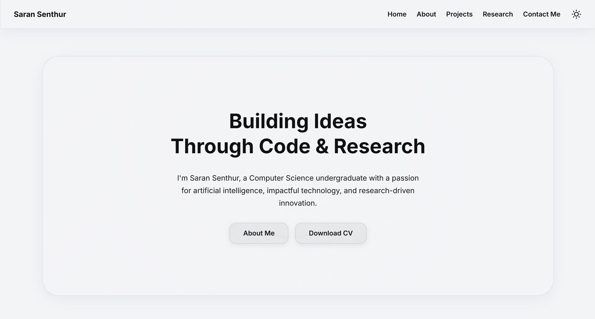
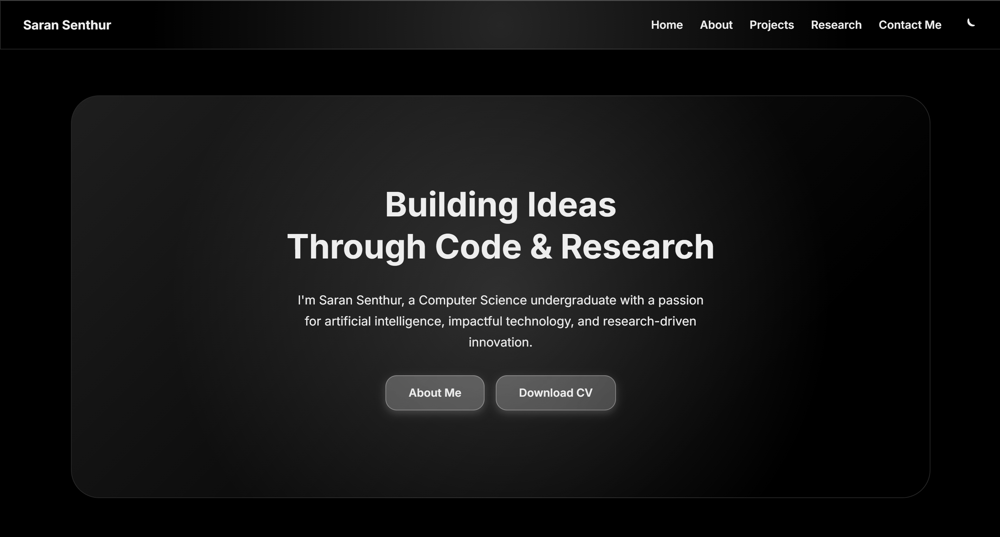

# 🌐 Saran Senthur — Personal Portfolio

Welcome to my personal portfolio website!  
This project showcases who I am, the work I've done, and how you can connect with me.

Built with **HTML**, **Tailwind CSS**, and **JavaScript**, this responsive site supports both **light** and **dark** modes, includes smooth animations, and serves as a digital resume and portfolio.

---

## ✨ Features

- 🔁 Light / Dark mode toggle
- 🧠 About Me section
- 💼 Project highlights
- 🧪 Research summary
- 📩 Contact form (Formspree)
- 📱 Fully responsive and mobile-friendly
- 🎯 Smooth scrolling and animations

---

## 📸 Screenshots

### 🔆 Light Mode

### 🌙 Dark Mode

---

## 🚀 Live Demo

🔗 [View Portfolio](https://saransenthurwork.github.io/portfolio/)

---

## 🛠️ Technologies Used

- HTML5
- Tailwind CSS
- JavaScript
- AOS (Animate on Scroll)
- Formspree (for contact form)